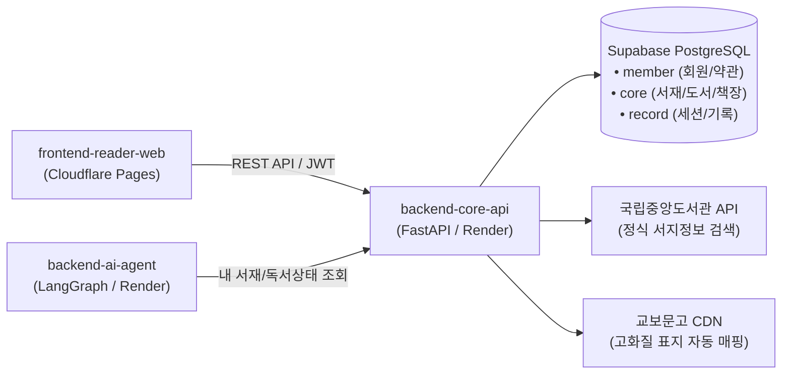

# backend-core-api 🐾📚

> **DPYB (Don't Paw-get Your Book) 핵심 비즈니스 & 데이터 영속화 서비스 (Single Source of Truth)**  
> 사용자 인증(자체/소셜/게스트), 3D 가상 서재 도서 및 책장 관리(LexoRank 순서 재정렬), 독서 세션(타이머) 및 감상 기록, 4종 사서 캐릭터 라이프사이클, 국립중앙도서관 서지 검색 및 월간 독서 정량 통계 집계를 전담하는 단일 진실 공급원입니다.

---

## 🏛️ 아키텍처 개요

DPYB 서비스는 사용자 가상 서재 웹(`frontend-reader-web`)과 AI 사서/토론 에이전트(`backend-ai-agent`)를 연결하는 중심 허브로서 `backend-core-api`를 운용합니다.



---

## 💡 주요 기능 및 엔지니어링 특징

### 1. 🔐 완전한 인증/인가 체계 & 게스트 모드
- **JWT 이중 토큰 & HttpOnly 쿠키**: Access Token(Bearer 헤더, 메모리 관리)과 Refresh Token(HttpOnly 쿠키, `/auth/refresh` 무중단 자동 갱신) 운용.
- **Google & Kakao 소셜 로그인**: OAuth 2.0 Web Client 토큰 검증 및 회원 자동 생성/연동.
- **해커톤 심사용 게스트 모드 (`POST /api/v1/auth/guest`)**: 원클릭 둘러보기 전용 게스트 JWT 발급 및 **무결점 Read-Only 락(모든 쓰기 요청 403 차단)** 적용.
- **공개 데모 계정 쓰기 보호 (Allowlist)**: 심사용 공개 데모 계정(`DEMO_MEMBER_ID`)의 비밀번호 변경, 탈퇴 등 파괴적 행위 차단 및 시연용 쓰기 작업만 선택적 허용.

### 2. 📚 가상 서재 & 62진수 LexoRank 순서 제어
- **사전식 정렬 알고리즘 (`ShelfRank`)**: 62진수 LexoRank 문자열 정렬을 적용하여 `PATCH /api/v1/library/books/{id}/order` 호출 시 대규모 row 업데이트 없이 O(1) 순서 재정렬 및 자동 재분배(rebalance) 지원.
- **책장 & 도서 격리 무결성**: 도서 삭제 시 스크랩 캐스케이드 Soft Delete, 기본 책장 삭제 방지 및 소속 도서 기본 책장 자동 이관.
- **독서 진도율 자동 동기화**: 진행률 100% 도달 시 `COMPLETED`(완독) 자동 전이 및 완독일시(`completed_at`) 기록.

### 3. ⏱️ 독서 집중 타이머 세션 및 월간 통계 집계
- **정밀 독서 세션 (`POST /api/v1/books/{id}/reading-sessions`)**: 60초 미만 초 단위 시간(`duration_seconds`)을 강제 올림 없이 정밀 보존하며 도서 진도율과 자동 동기화.
- **월간 독서 통계 엔진 (`GET /api/v1/reports/monthly-stats`)**: 완독수, 누적 페이지, 총 독서시간, 요일/시간대/날씨 분포, 최장 Streak, KDC 10대 장르 다양성/편독 지수 전수 집계.

### 4. 🧭 다계층 KDC 파서 & 교보문고 고화질 표지 매핑
- **KDC 제6판 표준 매핑 & 다계층 정규식 추출**: 5자리 ISBN 부가기호(`03320`, `93810`), 도서관 청구기호 라벨(`813.6-박24ㄱ`), 표준 3자리 코드를 정밀 파싱하여 한국십진분류법 10대 대분류 및 세부 주제(SF, IT, 에세이 등) 자동 분류.
- **교보문고 고화질 CDN 0ms 무지연 폴백**: 국립중앙도서관 API 표지 누락 시 458px 교보문고 정식 표지 CDN(`contents.kyobobook.co.kr`) 자동 조립 매핑.

---

## 🛠️ 기술 스택

| 구분 | 사용 기술 |
|---|---|
| **언어 & 프레임워크** | Python 3.12, FastAPI, Pydantic v2 |
| **ORM & 비동기 DB** | SQLAlchemy 2.0 (`asyncpg`), Alembic |
| **데이터베이스** | Supabase PostgreSQL (Free Tier, `member`, `core`, `record` 스키마 격리) |
| **인프라 & 배포** | Render Web Service (Dockerfile 동적 `$PORT` 바인딩) |
| **코드 품질 & 테스트** | Ruff (린트/포맷), Mypy (정적 타입), Pytest (단위/통합 테스트 111개 100% Pass) |

---

## 📂 프로젝트 구조

```text
backend-core-api/
├── app/
│   ├── main.py                  # FastAPI 진입점, CORS, 게스트/데모 보안 미들웨어, 듀얼 로깅
│   ├── config.py                # Pydantic Settings 환경설정 및 Fail-Fast 보안 검증
│   ├── core/                    # 에러 코드, 보안(JWT/Password), LexoRank, KDC 매퍼
│   ├── db/                      # SQLAlchemy 비동기 엔진, 세션 팩토리, Base 모델
│   ├── models/                  # SQLAlchemy ORM 엔티티 (member, shelf, book, scrap, record, librarian)
│   ├── schemas/                 # Pydantic v2 DTO 요청/응답 스키마
│   ├── services/                # 비즈니스 로직 계층 (도서/서재, 인증, 독서세션, 리포트 집계)
│   └── routers/                 # 라우터 엔드포인트
│       ├── health.py            # 헬스체크 (GET /health)
│       ├── auth.py              # 자체/소셜(Google·Kakao)/게스트 로그인 & 토큰 갱신
│       ├── users.py             # 회원 프로필 조회/수정, 비밀번호 변경, 회원 탈퇴
│       ├── terms.py             # 약관 조회 및 동의
│       ├── search.py            # 국립중앙도서관 서지정보 및 기등록 도서 검색
│       ├── shelves.py           # 책장 CRUD
│       ├── books.py             # 서재 도서 CRUD, LexoRank 순서 재정렬, 진도율
│       ├── scraps.py            # 문장 스크랩 CRUD
│       ├── reading_sessions.py  # 독서 타이머 세션 기록
│       ├── records.py           # 독서 감상평 기록
│       ├── librarians.py        # 사서 4종 마스터, 보유 사서, 대표 사서 관리
│       ├── reports.py           # 월간 독서 정량 통계 집계
│       └── admin.py             # 데모 시드 데이터 멱등 리셋 (관리자 전용)
├── alembic/                     # DB 마이그레이션 버전 관리
├── tests/                       # 111개 단위/통합 테스트 스위트
├── Dockerfile                   # 컨테이너 빌드 (Alembic 자동 마이그레이션 포함)
├── requirements.txt
└── README.md
```

---

## 📋 핵심 API 엔드포인트 요약

| 도메인 | 메서드 | 경로 | 설명 |
| :--- | :--- | :--- | :--- |
| **시스템** | `GET` | `/health` | 서비스 헬스체크 (중앙 Keep-Alive 크론 대응) |
| **인증 & 회원** | `POST` | `/api/v1/auth/login` | 이메일 자체 로그인 / 자동 회원가입 |
| | `POST` | `/api/v1/auth/oauth/google`, `/kakao` | 소셜 로그인 |
| | `POST` | `/api/v1/auth/guest` | [DPYB 체험하기] 게스트 모드 토큰 발급 |
| | `POST` | `/api/v1/auth/refresh` | HttpOnly 쿠키 기반 Access Token 갱신 |
| | `GET` | `/api/v1/users/me` | 로그인 회원 프로필 및 대표 사서 조회 |
| | `POST` | `/api/v1/auth/password/change` | 로그인 회원 비밀번호 변경 |
| **서재 & 도서** | `GET` | `/api/v1/books/search?isbn={isbn}` | 국립중앙도서관 API 서지정보 검색 |
| | `POST` | `/api/v1/library/books` | 서재 도서 등록 (LexoRank 순서 자동 부여) |
| | `GET` | `/api/v1/library/books` | 내 서재 도서 목록 조회 (상태/장르 필터 지원) |
| | `GET` | `/api/v1/library/books/{bookId}` | 도서 상세 조회 |
| | `PATCH` | `/api/v1/library/books/{bookId}/order` | 책장 내 도서 순서 O(1) 재배치 |
| | `PATCH` | `/api/v1/library/books/{bookId}/progress` | 독서 진도율(페이지) 업데이트 및 완독 승격 |
| | `DELETE`| `/api/v1/library/books/{bookId}` | 도서 삭제 (소속 스크랩 Cascade Soft Delete) |
| **독서 타이머** | `POST` | `/api/v1/books/{bookId}/reading-sessions` | 타이머 종료 시 초 단위 세션 저장 및 진도율 갱신 |
| | `GET` | `/api/v1/books/{bookId}/reading-sessions` | 도서별 독서 세션 히스토리 목록 조회 |
| **통계 리포트** | `GET` | `/api/v1/reports/monthly-stats` | 01~05번 월간 정량 통계 (완독, 시간, 장르 등) 집계 |
| **사서 캐릭터** | `GET` | `/api/v1/librarian-types` | 4종 사서(블루/슈빌/누디/게코) 메타데이터 카탈로그 |
| | `GET` | `/api/v1/librarians` | 내가 보유한 사서 목록 조회 |
| | `PATCH` | `/api/v1/librarians/{id}/representative` | 대표 사서 지정 |

---

## 🚀 로컬 개발 및 테스트

```bash
# 1. 가상환경 생성 및 의존성 설치
uv venv --python 3.12 .venv
source .venv/bin/activate
uv pip install -r requirements.txt

# 2. 환경변수 설정
cp .env.example .env

# 3. DB 마이그레이션 적용 (Alembic)
alembic upgrade head

# 4. 단위 및 통합 테스트 실행 (111개 테스트)
pytest -v

# 5. 로컬 개발 서버 실행
uvicorn app.main:app --host 0.0.0.0 --port 8000 --reload
```