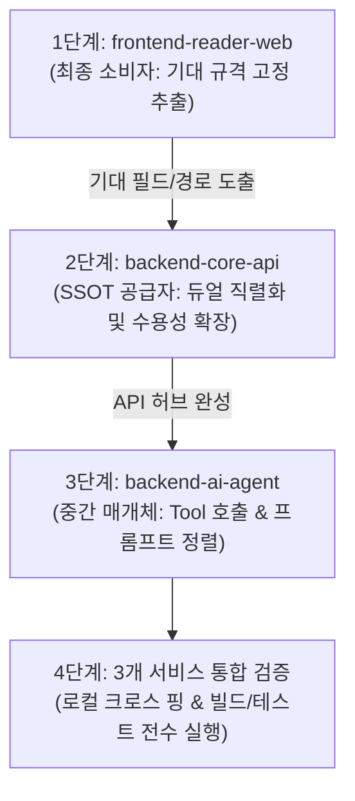

# 서비스 간 통신 계약 검증 및 일치화 가이드 (Cross-Repo Contract Alignment Guide)

> **목적**: 마이크로서비스 및 멀티 레포(`frontend-reader-web`, `backend-core-api`, `backend-ai-agent`) 환경에서 바이브 코딩/AI 페어 프로그래밍 시 발생하는 **통신 계약 불일치(Contract Drift)**를 선제적으로 방지하고, 체계적으로 전수 정렬하기 위한 실전 표준 가이드.

---

## 1. 배경 및 문제 의식

AI 에이전트와 페어 프로그래밍을 진행할 때, **단일 레포 내에서는 테스트가 100% 통과하고 CI가 초록불**이어도 실제 통합 시 아래와 같은 치명적인 문제가 자주 발생합니다:

- **필드명 불일치 (Silent Failure)**: 프론트엔드는 `res.books`를 찾는데 백엔드는 `res.items`를 반환하여 런타임 에러 없이 화면에 빈 목록만 렌더링됨.
- **라우트 경로 불일치 (404 Not Found)**: AI Agent는 `/api/v1/books/{id}`를 호출하는데 백엔드는 `/api/v1/library/books/{id}`에만 라우트가 등록되어 있음.
- **파라미터 제약 불일치 (422 Unprocessable Entity)**: 클라이언트는 키워드 검색(`query=...`)을 보내는데 백엔드는 `isbn`을 필수 쿼리로 강제함.
- **인증 헤더 요구 불일치 (401 Unauthorized)**: 공개 검색이나 AI 에이전트 백투백(B2B) 호출인데 사용자 Bearer 토큰을 필수로 요구함.

이 가이드는 이러한 문제를 **배포 전에 완벽히 해결**하기 위한 순서, 점검 항목, 복사해서 바로 쓰는 AI 프롬프트, 자가 검증 루프를 제공합니다.

---

## 2. 레포지토리 작업 순서 (Alignment Sequence)

반드시 **"소비자(Consumer) 주도 분석 ➔ 핵심 공급자(Provider) 수용성 확장 ➔ 오케스트레이터(Orchestrator) 연계 검증"** 순서를 따릅니다.



### 왜 이 순서여야 하는가?
1. **1단계 (`frontend-reader-web`)**:
   - 프론트엔드는 사용자 화면과 직결되어 있어 변경 비용이 가장 큽니다.
   - 프론트엔드 API 클라이언트(`api/*.js`)가 **실제로 어떤 URL을 호출하고 응답 객체의 어떤 키를 꺼내 쓰는지**가 변경 불가능한 "기준 진실(Baseline)"이 됩니다.
2. **2단계 (`backend-core-api`)**:
   - 데이터의 단일 진실 공급원(SSOT)이자 프론트엔드와 AI 에이전트 모두의 요청을 받는 허브입니다.
   - 포스텔의 법칙(Postel's Law: "받는 것은 관대하게, 주는 것은 다양하게")을 적용하여 프론트엔드와 AI 에이전트 양쪽의 기대를 모두 수용하도록 DTO와 라우트를 확장합니다.
3. **3단계 (`backend-ai-agent`)**:
   - Core API의 데이터를 읽어서(Tool) LLM 추론을 거친 뒤 다시 프론트엔드로 전달하는 중간 오케스트레이터입니다.
   - Core API가 양방향 호환을 갖춘 뒤 작업해야 목(Mock) 의존 없이 실제 스펙을 일치시킬 수 있습니다.

---

## 3. 4대 계약 점검 매트릭스 (Checklist Matrix)

각 레포를 검토할 때 아래 4가지 레이어를 반드시 전수 대조합니다:

| 레이어 | 점검 항목 | 점검 포인트 | 모범 해결책 |
| :--- | :--- | :--- | :--- |
| **1. 라우트 경로** | URI & HTTP Method | 복수형/단수형(`book` vs `books`), 프리픽스 누락, `/library/books` vs `/books` | 양쪽 경로 모두 지원하는 **별칭(Alias) 라우트** 등록 |
| **2. 인증/인가** | Auth Headers & Scope | `Bearer Token` 필수 여부, `X-Member-Id` 병행 지원, 쿠키 세션 | 비회원/서비스 호출 엔드포인트에 `get_optional_member_id` 적용 |
| **3. 요청 규격** | Query Params & Body | camelCase vs snake_case, 필수(Required) vs 선택(Optional) | 쿼리 파라미터 기본값 제공, 정규식/포맷 유연화(`isbn` 또는 `query`) |
| **4. 응답 규격** | Response Body Schema | 리스트 래퍼 키(`items` vs `books`), 상세 필드 누락, 에러 포맷 | Pydantic `@computed_field`로 듀얼 직렬화, 공통 에러 규격 통일 |

---

## 4. 레포별 전용 실행 프롬프트 (Copy & Paste)

각 레포 작업을 시작할 때 AI 어시스턴트(Claude Code, Antigravity, Cursor 등)에게 그대로 전달하는 프롬프트입니다.

### 📋 [프롬프트 1] `frontend-reader-web` (기대 규격 추출용)
```markdown
우리 프로젝트의 백엔드 서비스들과 통신 계약을 일치시키기 위해 프론트엔드의 API 호출 규격을 전수 조사하려고 합니다.
코드베이스의 `app/api/` (또는 `src/api/`) 및 주요 호출 컴포넌트들을 스캔하여 아래 정보를 표(Table)로 정리해 주세요:

1. 호출 함수명 및 대상 파일
2. HTTP 메소드 및 요청 상대 경로 (예: GET /library/books, POST /auth/login)
3. 요청 헤더 (Authorization 필요 여부, credentials 쿠키 포함 여부)
4. 전송 파라미터 (Query string 키 목록, Request Body 필드명과 camelCase 여부)
5. 응답 본문에서 실제로 꺼내 쓰는 필드명 (예: `res?.books`, `res?.scraps`, `res?.token`, `res?.member`)

추출 후, 백엔드 응답이 `items`나 snake_case로 올 때 깨질 수 있는 잠재적 취약 지점을 목록으로 짚어주세요.
```

### 📋 [프롬프트 2] `backend-core-api` (수용성 확장 및 일치화용)
```markdown
프론트엔드(`frontend-reader-web`)와 AI 에이전트(`backend-ai-agent`)의 통신 계약 분석 결과에 맞춰 `backend-core-api`의 수용성을 전면 확장하려고 합니다.

[작업 지침]:
1. 페이징 응답 호환:
   - 프론트엔드가 `res.books`, `res.scraps`를 참조하고 AI 에이전트가 `res.items`를 참조하므로, Pydantic `@computed_field`를 활용하여 `items`, `books`, `scraps`가 모두 직렬화되도록 `LibraryBookPageResponse`, `ScrapPageResponse`를 구현하고 라우터에 적용해 주세요.
2. 라우트 별칭 및 선택적 인증:
   - AI 에이전트가 호출하는 `GET /api/v1/books/{book_id}` 별칭 라우트를 추가하고, 비회원 또는 서비스 간 호출 시 401이 나지 않도록 `get_optional_member_id`를 적용해 주세요.
   - `GET /api/v1/books/search`에서 `isbn`뿐만 아니라 `query`(도서명/키워드)도 수용하고, 응답 DTO에 AI 에이전트 호환용 `books` 리스트를 계산해 주세요.
3. 소셜 로그인 프로필 즉시 반환:
   - `POST /api/v1/auth/social/*` 응답 모델을 `LoginResponse`로 격상하여 `member` 프로필이 토큰과 함께 반환되도록 해주세요.
4. 테스트 및 검증:
   - 추가된 호환 필드와 엔드포인트에 대한 단위/통합 테스트를 작성하고, 기존 테스트 포함 100% 통과와 `ruff check`, `mypy` 무결점을 보장해 주세요.
```

### 📋 [프롬프트 3] `backend-ai-agent` (오케스트레이션 검증용)
```markdown
`backend-core-api`와의 통신 클라이언트(`core_api_client.py`) 및 사서 도구(Tool), 월간 리포트 생성 파이프라인의 통신 계약을 검증해 주세요.

[작업 지침]:
1. CoreApiClient의 호출 엔드포인트 목록 전수 점검:
   - 도서 상세(`GET /api/v1/books/{id}`), 도서 검색(`GET /api/v1/books/search`), 내 서재(`GET /api/v1/library/books`), 월간 통계(`GET /api/v1/reports/monthly-stats`)의 파라미터 및 헤더(Token Relay / X-Member-Id)가 Core API 스펙과 일치하는지 확인.
2. 월간 리포트 스키마 대조:
   - Core API의 `MonthlyReportStatsResponse` (01~05 정량 통계)와 AI Agent의 리포트 생성기(`build_monthly_report`)가 사용하는 필드명 및 계층 구조 1:1 일치 여부 확인.
3. 사서 4종 페르소나 메타데이터:
   - Core API의 `GET /api/v1/librarian-types`에서 내려주는 메타데이터(CAT="블루", SHOEBILL="슈빌", SEA_SLUG="누디", GECKO="게코") 및 종결어미가 프롬프트 템플릿과 일치하는지 확인.
4. 단위 테스트 전수 실행 및 통과 보장.
```

---

## 5. 실전 내부 피드백 & 개선 사이클 (Self-Critique & Enhancement)

가이드 작성 후 자체 점검을 거쳐 보강된 3가지 핵심 실전 원칙입니다:

### 💡 피드백 1: 단순 스펙 일치만으로 부족하고, 런타임 크로스 테스트가 필요한가?
- **개선책**: 각 레포의 단위 테스트 모의(Mock)에만 의존하지 말고, 아래와 같이 로컬에서 3개 서비스를 띄우고 단 3줄의 `curl`로 E2E 연동을 실증해야 합니다.
  ```bash
  # 1. Core API 로그인 및 쿠키/토큰 획득
  AUTH_RES=$(curl -s -X POST http://127.0.0.1:8000/api/v1/auth/login -H "Content-Type: application/json" -d '{"email":"test@dontpawget.app"}')
  TOKEN=$(echo $AUTH_RES | jq -r '.accessToken')

  # 2. Core API 도서 목록 조회 (books와 items 동시 존재 확인)
  curl -s -H "Authorization: Bearer $TOKEN" http://127.0.0.1:8000/api/v1/library/books | jq '{hasItems: (.items != null), hasBooks: (.books != null)}'

  # 3. AI Agent 월간 리포트 오케스트레이션 호출 (Core API 8000 연동 실증)
  curl -s -H "Authorization: Bearer $TOKEN" "http://127.0.0.1:8001/api/v1/reports/monthly?year=2026&month=9" | jq '.librarian.name'
  ```

### 💡 피드백 2: 프론트엔드가 레거시이거나 즉시 수정할 수 없는 상황일 때는?
- **개선책 (포스텔의 법칙 극대화)**:
  - 백엔드가 무조건 **듀얼 직렬화(Dual Serialization)**를 지원합니다.
  - 새 스키마 키(`items`)와 구 스키마 키(`books`)를 둘 다 내려주면, 프론트엔드 배포 주기와 백엔드 배포 주기가 어긋나더라도 장애가 전혀 발생하지 않습니다.

### 💡 피드백 3: 변경 후 하네스 문서 관리가 누락되는 문제는?
- **개선책**:
  - 통신 계약이 변경되거나 새 호환 필드가 추가될 때마다 즉시 `.harness/STATE.md`에 단 한 줄로 기록하고, 중요한 설계 이유(예: 듀얼 직렬화 채택 이유)를 `.harness/DECISIONS.md` 최상단에 남깁니다.

---

## 6. 요약 워크플로우 치트시트

1. `frontend-reader-web`에서 프롬프트 1 실행 ➔ 호출 URL & `res.` 참조 키 목록 캡처
2. `backend-core-api`에서 프롬프트 2 실행 ➔ 별칭 라우트, `@computed_field` 듀얼 응답, 선택적 인증 적용
3. `backend-ai-agent`에서 프롬프트 3 실행 ➔ `core_api_client.py` 및 프롬프트 페르소나 메타데이터 동기화
4. 3개 레포에서 테스트 실행 (`pytest`, `npm run build`) ➔ 100% Pass 확인
5. 커밋 및 PR 생성 (하네스 문서 동기화 필수)
